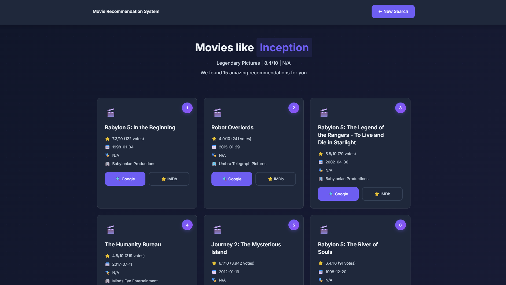

# 🎬 Movie Recommendation System

> An AI-powered movie recommendation engine built with Django & scikit-learn.  
> Trained on the TMDB dataset (930K+ movies), delivering instant content-based recommendations through a clean web interface and REST API.

[](https://www.python.org/)
[](https://djangoproject.com/)
[](https://scikit-learn.org/)
[](LICENSE)

---


---

## 📑 Table of Contents

- [Overview](#-overview)
- [Screenshots](#-screenshots)
- [How It Works](#-how-it-works)
- [Getting Started](#-getting-started)
- [Model Training](#-model-training)
- [API Reference](#-api-reference)
- [Project Structure](#-project-structure)
- [Configuration](#-configuration)
- [Deployment](#-deployment)
- [Contributing](#-contributing)
- [License](#-license)

---

## 🎯 Overview


This system recommends movies based on **content similarity** — genres, keywords, plot summaries, taglines, and production companies are combined into a rich feature vector using TF-IDF, then compared via cosine similarity.

### Highlights

| Feature | Detail |
|---------|--------|
| **Dataset** | TMDB 2023 — 930K+ movies |
| **Algorithm** | TF-IDF + Cosine Similarity (optional SVD reduction) |
| **Recommendations** | 15 similar movies per query |
| **Search** | Real-time autocomplete with fuzzy matching |
| **Response Time** | < 50ms per recommendation |
| **Scalable** | Configurable from 2K → 1M+ movies |

### Tech Stack

- **Backend** — Django 6.0, Django REST Framework, Gunicorn
- **ML / Data** — scikit-learn, pandas, NumPy, SciPy
- **Storage** — Parquet (metadata), sparse NPZ (similarity matrix)
- **Static Files** — WhiteNoise with Brotli compression
- **Caching** — Django local memory cache (Redis-ready)

---

## 📸 Screenshots

### Demo


### Model Loading Screen


### Home — Search Interface


### Results — Movie Recommendations



---

## 🧠 How It Works

```
┌─────────────┐     ┌──────────────┐     ┌───────────────────┐     ┌──────────────┐
│  TMDB Data   │────▶│  Feature     │────▶│  TF-IDF + Cosine  │────▶│  Similarity  │
│  (930K+)     │     │  Engineering │     │  Similarity       │     │  Matrix      │
└─────────────┘     └──────────────┘     └───────────────────┘     └──────────────┘
                           │                                              │
                    ┌──────┴──────┐                                ┌──────┴──────┐
                    │ • Genres    │                                │  Django App  │
                    │ • Keywords  │                                │  serves top  │
                    │ • Overview  │                                │  N matches   │
                    │ • Tagline   │                                └─────────────┘
                    │ • Companies │
                    └─────────────┘
```

1. **Feature Engineering** — Genres, keywords, plot overview, tagline, and production companies are parsed, cleaned, stemmed, and concatenated into a single text "soup" per movie.
2. **TF-IDF Vectorization** — The soup text is vectorized using TF-IDF (1–2 word n-grams, up to 20K features).
3. **Dimensionality Reduction** *(optional)* — TruncatedSVD compresses the matrix for large datasets (100K+ movies).
4. **Cosine Similarity** — A pairwise similarity matrix is precomputed and stored as a sparse `.npz` file.
5. **Serving** — At runtime, the Django app loads the matrix into memory and retrieves the top-N most similar movies instantly.

---

## 🚀 Getting Started

### Prerequisites

- Python 3.11+
- pip
- 4 GB RAM minimum (8 GB recommended for training)
- [Kaggle account](https://www.kaggle.com/) (free — needed to download the TMDB dataset)

### 1. Clone & Set Up

```bash
git clone https://github.com/yourusername/movie-recommendation-system.git
cd movie-recommendation-system

# Create and activate virtual environment
python -m venv venv

# Windows
venv\Scripts\activate

# macOS / Linux
source venv/bin/activate

# Install dependencies
pip install -r requirements.txt
```

### 2. Train the Model

The recommendation engine needs trained model files. Install the training dependencies and run the training script:

```bash
pip install kagglehub nltk
python training/run_training.py
```

> **Note:** On first run this downloads the TMDB dataset (~250 MB) from Kaggle. You'll need your Kaggle API credentials configured — see [Kaggle API docs](https://www.kaggle.com/docs/api).

After training completes, move the generated model files to the expected directory:

```bash
# The training script saves to ./models by default
# The Django app reads from ./training/models
move models\* training\models\
```

### 3. Run the Server

```bash
python manage.py migrate
python manage.py runserver
```

Open **http://localhost:8000** — you're ready to go! 🎉

---

## 🎓 Model Training

The training pipeline lives in `training/` and supports three configurations:

| Config | Movies | Quality Filter | RAM Needed | Time |
|--------|--------|---------------|-----------|------|
| **Fast** | 10K | `high` (500+ votes) | ~4 GB | ~2 min |
| **Standard** | 50K | `medium` (50+ votes) | ~8 GB | ~10 min |
| **Full** | All (930K+) | `low` (5+ votes) | ~16 GB | ~30+ min |

### Custom Training

```python
from training.train import MovieRecommenderTrainer

trainer = MovieRecommenderTrainer(
    output_dir='./training/models',
    use_dimensionality_reduction=True,  # SVD for large datasets
    n_components=500                     # Latent features
)

df, sim_matrix = trainer.train(
    'path/to/TMDB_movie_dataset_v11.csv',
    quality_threshold='medium',  # 'low', 'medium', or 'high'
    max_movies=50000              # None = use all
)
```

### Model Artifacts

After training, the following files are generated:

| File | Description |
|------|-------------|
| `movie_metadata.parquet` | Movie info (title, genres, rating, etc.) |
| `similarity_matrix.npz` | Precomputed cosine similarity (sparse) |
| `title_to_idx.json` | Movie title → matrix index mapping |
| `tfidf_vectorizer.pkl` | Fitted TF-IDF vectorizer |
| `config.json` | Training configuration metadata |

For detailed training documentation, see [training/guide.md](training/guide.md).

---

## 📡 API Reference

### Endpoints

| Method | Endpoint | Description |
|--------|----------|-------------|
| `GET` | `/` | Home page — search interface |
| `POST` | `/` | Submit search, returns recommendations |
| `GET` | `/api/search/?q=<query>` | Autocomplete search |
| `GET` | `/api/model-status/` | Model loading status |
| `GET` | `/api/health/` | Health check |

### Search Movies (Autocomplete)

```http
GET /api/search/?q=inception
```

```json
{
  "movies": ["Inception", "Inception: The Cobol Job"],
  "count": 2
}
```

### Model Status

```http
GET /api/model-status/
```

```json
{
  "loaded": true,
  "progress": 100,
  "status": "ready"
}
```

### Health Check

```http
GET /api/health/
```

```json
{
  "status": "healthy",
  "movies_loaded": 6248,
  "model_dir": "training/models",
  "model_loaded": true
}
```

---

## 📁 Project Structure

```
movie-recommendation-system/
├── movie_recommendation/          # Django project config
│   ├── settings.py                #   Settings (DB, cache, logging, etc.)
│   ├── urls.py                    #   Root URL routing
│   └── wsgi.py                    #   WSGI entry point
│
├── recommender/                   # Main Django app
│   ├── views.py                   #   Recommendation logic & API views
│   ├── urls.py                    #   App URL patterns
│   └── templates/recommender/     #   HTML templates
│       ├── index.html             #     Search page
│       ├── result.html            #     Recommendations page
│       └── error.html             #     Error page
│
├── training/                      # ML training pipeline
│   ├── train.py                   #   MovieRecommenderTrainer class
│   ├── run_training.py            #   One-click training script
│   ├── infer.py                   #   Standalone inference examples
│   ├── guide.md                   #   Detailed training documentation
│   └── models/                    #   Trained model artifacts (generated)
│
├── static/                        # Static assets (CSS, JS, images)
├── assets/                        # README screenshots & demo video
├── requirements.txt               # Python dependencies
├── manage.py                      # Django management script
├── Procfile                       # Heroku deployment
├── render.yaml                    # Render deployment
└── LICENSE                        # MIT License
```

---

## ⚙️ Configuration

### Environment Variables

| Variable | Default | Description |
|----------|---------|-------------|
| `SECRET_KEY` | dev key (insecure) | Django secret key |
| `DEBUG` | `True` | Debug mode |
| `ALLOWED_HOSTS` | `localhost,127.0.0.1` | Comma-separated allowed hosts |
| `MODEL_DIR` | `training/models` | Path to trained model directory |
| `CORS_ALLOWED_ORIGINS` | `http://localhost:3000` | CORS whitelist |

### Switching Models

Point `MODEL_DIR` to any directory containing the trained model artifacts:

```bash
# Windows (PowerShell)
$env:MODEL_DIR = "C:\path\to\your\models"

# macOS / Linux
export MODEL_DIR=/path/to/your/models

python manage.py runserver
```

### Production Security

When `DEBUG=False`, the following are automatically enabled:
- SSL redirect
- Secure session & CSRF cookies
- XSS filter & content-type sniffing protection
- `X-Frame-Options: DENY`

---

## 🚀 Deployment

### Render

The project includes a `render.yaml` for one-click deployment:

1. Push code to GitHub
2. Connect the repo to [Render](https://render.com)
3. Set environment variables (`SECRET_KEY`, `DEBUG=False`, etc.)
4. Deploy

### Heroku

```bash
heroku create your-app-name
heroku config:set SECRET_KEY=your-secret-key DEBUG=False
git push heroku main
```

### Manual / VPS

```bash
pip install -r requirements.txt
python manage.py collectstatic --noinput
gunicorn movie_recommendation.wsgi:application --bind 0.0.0.0:8000
```

---

## 🤝 Contributing

Contributions are welcome! Please follow these steps:

1. Fork the repository
2. Create a feature branch — `git checkout -b feature/your-feature`
3. Commit your changes — `git commit -m "Add your feature"`
4. Push — `git push origin feature/your-feature`
5. Open a Pull Request

### Guidelines

- Follow [PEP 8](https://peps.python.org/pep-0008/) style
- Add tests for new functionality
- Update documentation for user-facing changes
- Keep commits atomic and descriptive

---

## 📄 License

This project is licensed under the **MIT License** — see the [LICENSE](LICENSE) file for details.

---

## 📚 Further Reading

| Resource | Description |
|----------|-------------|
| [PROJECT_GUIDE.md](PROJECT_GUIDE.md) | Complete technical guide — installation, architecture, deployment, troubleshooting |
| [training/guide.md](training/guide.md) | In-depth model training documentation |
| [CHANGELOG.md](CHANGELOG.md) | Version history and release notes |

---

<div align="center">

**Built with ❤️ for movie lovers**

⭐ Star this repo if you found it useful!

</div>
